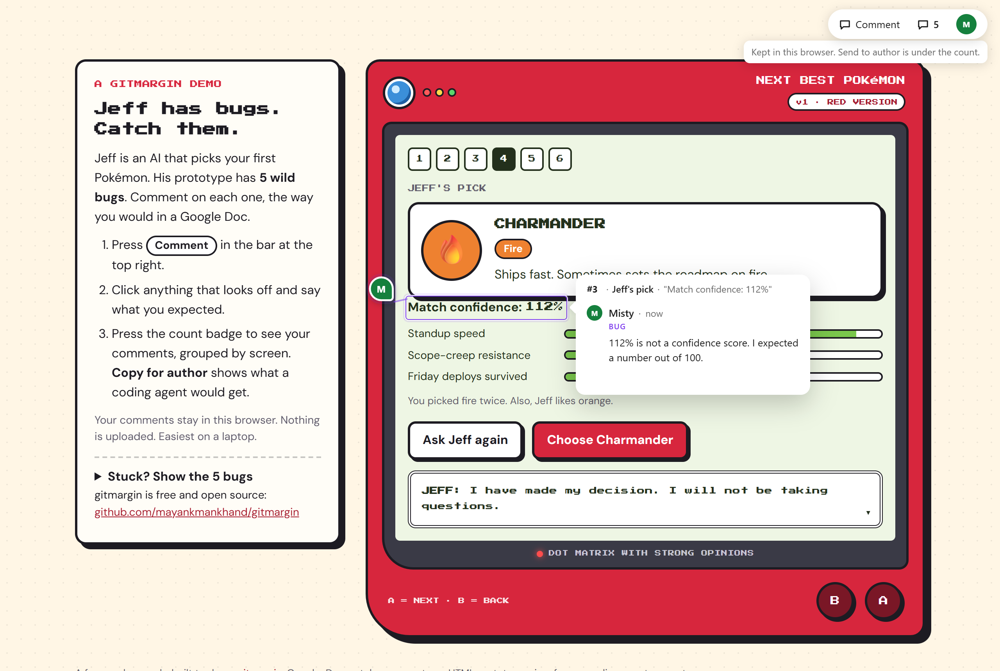
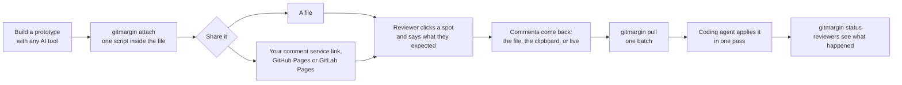

# gitmargin

[](https://github.com/mayankmankhand/gitmargin/actions/workflows/ci.yml) [](LICENSE) [](CHANGELOG.md)

**Google-Docs-style comments on HTML prototypes, in a form a coding agent can act on.**

**For** anyone who builds HTML prototypes with an AI coding agent and needs a team's comments on them, and for the agent that applies those comments.

**Try it:** the [live demo](https://mayankmankhand.github.io/gitmargin/), a Pokémon prototype with five planted bugs, needs no install and no sign-up. To use it on your own prototypes, install the [Claude Code plugin](docs/claude-code.md) or [clone the repo](#running-it-today).

**Status:** early stage. Comments on a single file are built and tested; shared live comments and sign-in with GitLab or GitHub are built and tested with real accounts; the rest is parked until it can be tested. The full list, with dates, is [ROADMAP.md](ROADMAP.md).



**Contents:** [The problem](#the-problem) · [How it works](#how-it-works) · [What the agent gets](#what-the-agent-gets) · [Three ways to run it](#three-ways-to-run-it) · [Running it today](#running-it-today) · [Design principles](#design-principles) · [What exists today](#what-exists-today-and-where-the-gap-is) · [Roadmap](#roadmap) · [Prior art](#prior-art-and-credit-where-its-due) · [License](#license)

## The problem

AI tools now produce working HTML prototypes in minutes; a PM can go from idea to clickable page before lunch. The feedback loop has not caught up. The prototype reaches the team as an `.html` file dropped into Slack, and what comes back is "make this bigger": a screenshot, a bullet list, or "let's hop on a call". Bigger what? On which of the four screens? A coding agent cannot act on that, and three days later neither can you. The two things a reviewer forgets to say, where they were and what they expected, are exactly what an agent needs.

A second problem sits behind the first. Most prototypes are private: GitLab Pages for project members only, Vercel or Netlify behind a password or single sign-on, an internal server behind a VPN. Commenting tools either cannot reach them or bolt on a second login that reviewers have to join before they can say "make the header bigger". gitmargin's second part is for that, and it reuses the login your host already has; see [Three ways to run it](#three-ways-to-run-it).

## How it works



- **One script inside your HTML file.** `gitmargin attach` writes a copy of the prototype with the overlay in it. A reviewer opens that copy anywhere, from disk included, presses **Comment**, clicks an element or highlights text, and says what they expected. Each comment leaves a pin with the writer's initials, shown only on the step it was made on, even when every step repeats the same Next button; a count badge opens the list of comments, grouped by screen.
- **Every comment carries where and why.** The step, tab or dialog that was open, the clicks that led there ("Next, Next, Continue"), the element or the words clicked, and one question answered in the reviewer's own words: *what did you expect here?*
- **Comments come back as a file, a text block, or live.** "Send to author" downloads the same HTML with the comments inside; "Copy for author" puts a readable block on the clipboard. Neither needs a server or an account. With the optional comment service, everyone who opens the page sees the same comments within seconds and can reply.
- **`gitmargin pull` makes one batch.** JSON with the rules for applying it carried inside, so a coding agent applies it in one pass; two reviewers' files merge into one batch. `gitmargin status` marks a comment applied or rejected, so the reviewer sees what became of it.

## What the agent gets

One line per comment: the tag, the screen, the clicks that got there, the element, then the reviewer's words verbatim. This is what "Copy for author" puts on the clipboard, and what `pull` prints alongside the JSON:

```text
1. [bug] On "Shipping address" (#step-3), after clicking Next, Next: the "Continue" button (#step-3 > div.actions > button.continue).
   "I expected this to stay disabled until the address is valid."
```

The JSON behind it, how "where" is captured, and the rules the agent follows are specified in [docs/batch-format.md](docs/batch-format.md). The few page shapes that can still put a pin on the wrong step are listed there too, in section 3.

## Three ways to run it

| | Just a file | Shared live comments | Sign-in |
|---|---|---|---|
| What you need | nothing beyond `gitmargin attach` | a comment service in your own Vercel account, set up with one command | the same service, plus a GitLab application or a GitHub App |
| Who can comment | whoever you send the file to | whoever can open the page: a key written into the page is the only gate | reviewers signed in with GitLab or GitHub, under their real names; optionally only one GitLab group, or only the people who can open one GitHub repository |
| Where the comments live | in the reviewer's browser until they send the file back | in your service's database, by version, with replies | the same |
| Where the page can live | anywhere, disk included | a file, the service's own link, GitHub Pages, GitLab Pages, Vercel, anywhere else | the same; on Vercel, [same-project mode](service/README.md#same-project-mode-on-vercel-the-page-and-its-comments-behind-one-login) puts the page and its comments behind Vercel's own login |
| Status | built and tested | built, and tested on a real Vercel plus Neon deployment | GitLab and GitHub built and tested with real accounts; Okta, Entra, Google and Slack parked |

gitmargin runs nothing and holds nothing: the service is yours, in your own account. One thing to know first: **attaching with `--service` uploads a copy of the page to your service**, and that copy is not behind whatever password protects the page on your host. If the prototype must stay behind your host's login, use the file route, or same-project mode on Vercel. The deploy steps and the [GitLab](service/README.md#sign-in-with-gitlab-optional-per-prototype) and [GitHub](service/README.md#sign-in-with-github-optional-per-prototype) sign-in setup are in [service/README.md](service/README.md), each with what it means in plain English; the design behind sign-in is [docs/part-2-design.md](docs/part-2-design.md).

## Running it today

**With Claude Code**, install the plugin and let Claude do the rest: it builds the prototype so comments land well, shares it with `/gitmargin:share`, and reads the comments back when you ask what reviewers said. Setup and the whole flow are in [docs/claude-code.md](docs/claude-code.md).

```text
/plugin marketplace add https://github.com/mayankmankhand/gitmargin.git
/plugin install gitmargin@gitmargin
```

The first time in a project, `/gitmargin:share` proposes one place to publish and asks once:

| Where the page lives | Who can open it | Good for |
|---|---|---|
| **A file you send** | whoever you send it to | a quick review; no account needed |
| **The service link** | anyone who has the link | most reviews; no host needed, the link never changes |
| **GitHub Pages** (public repositories only) | anyone on the internet | a public project that already lives on GitHub |
| **GitLab Pages** (private projects on gitlab.com) | the project's members, after GitLab's login | a private project on GitLab: the page itself stays private |

**By hand**, gitmargin is not on npm yet, so it runs from a clone of this repo:

```bash
git clone https://github.com/mayankmankhand/gitmargin.git
cd gitmargin
npm install && npm run build          # once: builds the overlay bundle

node bin/gitmargin.js attach prototype.html   # writes prototype.gitmargin.html
# send that file to a reviewer, any way you like; they open it and comment
node bin/gitmargin.js pull reviewed.html      # prints the batch as JSON
```

For shared, live comments, deploy the service once (`node plugin/scripts/setup.mjs`, in a terminal of your own; see [service/README.md](service/README.md)) and add one flag:

```bash
node bin/gitmargin.js attach prototype.html --service https://your-service.vercel.app
node bin/gitmargin.js pull prototype.gitmargin.html --live
```

Only the author runs these; a reviewer only ever opens an HTML file, with nothing installed.

**Try it in two minutes.** The repository carries a mock prototype, a seven-step headphone setup, so you need nothing of your own:

```bash
node bin/gitmargin.js attach fixtures/onboarding.html   # writes fixtures/onboarding.gitmargin.html
```

Open that file in your browser, press **Comment**, click anything on the page, and say what you expected. **Send to author** downloads the page with your comments inside, and `node bin/gitmargin.js pull` on that download prints them as the batch. Or skip the clone: the [live demo](https://mayankmankhand.github.io/gitmargin/) is the same overlay on a Pokémon prototype.

Your reviewer needs a current Chrome, Edge, Firefox or Safari; the measured floor is Chrome and Edge 88, Firefox 85, Safari 15.4, and [the split doc](docs/v0-split.md#what-a-reviewers-browser-has-to-be) says what each row means. Anything older says so on the page rather than quietly showing a prototype with no commenting on it. `npm test` runs the whole suite, [tests/README.md](tests/README.md) says what each file covers, and [CONTRIBUTING.md](CONTRIBUTING.md) is where to start on a change.

## Design principles

- **Feedback for an AI needs where and why, not just what.** "Make this bigger" is useless to an agent that cannot tell which of four screens "this" is on.
- **Comments are data, not screenshots.** Every comment is anchored to an element and stored as machine-readable data, so humans and agents can both act on it.
- **Works where you already deploy.** GitLab Pages, GitHub Pages, Vercel, a bucket, a folder on a server, or a file sent by hand. gitmargin never hosts your prototype or your comments.
- **The author owns the record.** Shared comments live in a database in the author's own account, not in one gitmargin runs.
- **No account beyond the one your host already requires.** gitmargin never adds a sign-up, and security is inherited rather than added: the prototype's existing access control becomes the comment system's access control.

## What exists today (and where the gap is)

| Category | Examples | What's missing |
|---|---|---|
| AI-agent review loops | [human-review](https://github.com/petergyang/human-review) by Peter Yang, Onlook, Plannotator, Agentation, Annotate.js | Local-first, single reviewer, no identity: great for *you* reviewing your own AI's work, not for a team. And none records which step the reviewer was on |
| Client-feedback SaaS | BugHerd, Markup.io, Usersnap | Separate accounts, separate database, struggle behind auth walls, upload your page to render screenshots |
| Platform-native comments | Vercel Preview Comments, Netlify Drawer | Genuinely solve this, *if* your whole team lives on that vendor. Locked to one platform |
| No-code CMS | Builder.io, Webstudio, Storyblok (and Coinbase's internal system) | Solve *editing* for marketers, not *reviewing* for teams |

A closer read of the four tools nearest to gitmargin's file route found that none records which step the reviewer was on, keeps a click trail, or asks what the reviewer expected: [research/agent-feedback-formats.md](research/agent-feedback-formats.md). The unclaimed square is platform-agnostic, identity-aware commenting on private prototypes, with no account beyond the one your host already requires and the record under your own control. The [research report](research/prior-art-landscape.md) has the full landscape, 166 sources, and a [glossary](research/prior-art-landscape.md#8-glossary) for terms such as OpenID Connect.

## Roadmap

- **Built and tested:** comments on a single file; shared live comments; sign in with GitLab and GitHub; the page and its comments behind Vercel's login; the Claude Code plugin, with a file, the service link, GitHub Pages and GitLab Pages as places to publish, a one-line setup, and a service that proves it holds your secret before the CLI sends it.
- **Next:** the first real review round, two reviewers on a real prototype ([#6](https://github.com/mayankmankhand/gitmargin/issues/6)); Vercel in the plugin; publishing to npm.
- **Parked until it can be tested:** the Slack mirror, an MCP server, the phone mode, the four one-day sign-in tests, Safari, overlay polish.

The diagram, the issue links, the dates and the reasons are in [ROADMAP.md](ROADMAP.md). Why v0 was split into a file first and sign-in second is [docs/v0-split.md](docs/v0-split.md); the original decision, with the alternatives, is [docs/v0-decision.md](docs/v0-decision.md).

If you've hit this problem, a prototype and no good way to collect feedback on it, I'd genuinely like to hear how you work around it today. Open an issue.

## Prior art and credit where it's due

This project stands on ideas from people who solved neighbouring problems:

- **[human-review](https://github.com/petergyang/human-review)** (Peter Yang, MIT) proved that "highlight, comment, agent applies the batch" is the right interaction for reviewing AI-generated HTML. Its JSON batch is the shape gitmargin's batch borrows.
- **[Annotate.js](https://github.com/reviewjs/annotate)** showed the single-file shape: one script tag, no server, comments downloaded and imported as JSON.
- **GitLab Visual Reviews** (GitLab 12.0 to 17.0) was almost exactly the sign-in idea: one script tag posting comments into the merge request. It was removed for low usage, most likely because reviewers had to paste an API token to use it. Validation and warning in one.
- **Vercel Preview Comments** and **Netlify Drawer** proved that identity-aware, on-page comments work when tied to the deploy platform, and Vercel now exports comments as JSON for agents. gitmargin tries to make that idea portable.
- **Coinbase's content platform** ([Scaling Content at Coinbase](https://medium.com/the-coinbase-blog)) proved that taking non-engineers out of the code-review loop collapses cycle time from weeks to hours.
- **Hypothesis, BugHerd, Markup.io** and the W3C Web Annotation model: a decade of prior art on anchoring comments to a page.

## License

[MIT](LICENSE).
