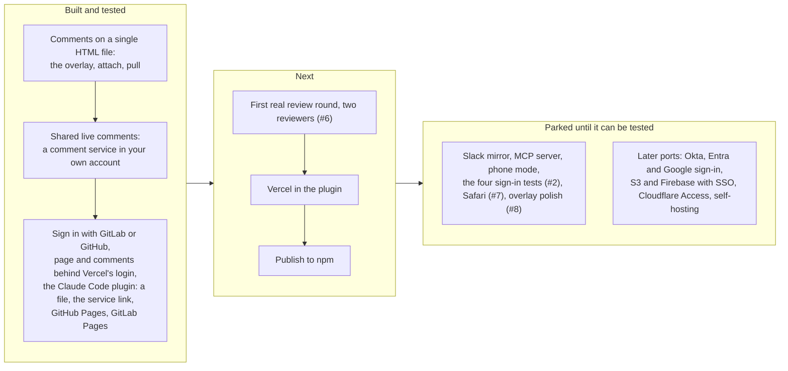

# Roadmap

What is built, what comes next, and what is parked, as of 2026-09-25. The diagram is Mermaid, which GitHub draws in
place; each box is one capability, and the list below carries the issue links and the detail. The README keeps a
three-line summary and points here, so this is the one place the list lives. "Walked" below means tried by hand, end to end, with
real accounts on a real host, not only by the test suite; the "spikes" are four one-day tests of what sign-in inside a
company has to survive.

## The list

- [x] **v0 part 1: the file.** The overlay (anchors, pins, comments, state capture, send back), `gitmargin attach` and `pull`, built and tested end to end.
- [ ] **The part-1 review round, the first with real reviewers** ([#6](https://github.com/mayankmankhand/gitmargin/issues/6)): a generated prototype sent as a file to two reviewers, comments back, Claude Code applies them without the author explaining where anything was.
- [x] **Shared live comments** ([#15](https://github.com/mayankmankhand/gitmargin/issues/15)). Built, tested against a local copy of the service, and checked on a real Vercel plus Neon deployment in Chrome and Firefox. The Deploy button follows Vercel's reference and has not been walked end to end. A comment service on Vercel plus Neon that each author deploys, comments by version with a stored copy of each version, replies, statuses, `pull --live`. No sign-in by default: a key in the page is the gate.
- [x] **Sign in with GitLab** ([#18](https://github.com/mayankmankhand/gitmargin/issues/18), cycle 1 of part 2). Built and walked live on gitlab.com: optional per prototype, verified names on comments, a members rule on one GitLab group, and strict reading. Chrome end to end; Firefox by the automated suite, and by hand as far as GitLab's login. The company single sign-on pass-through is untested.
- [x] **Sign in with GitHub** ([#17](https://github.com/mayankmankhand/gitmargin/issues/17), cycle 2 of part 2). Optional per prototype, through a GitHub App that asks for no permissions, with verified names on comments, an optional rule limiting commenting to one repository (the App then needs one read-only permission), and strict reading; tested against a stand-in GitHub in Chromium and Firefox, and walked on the real github.com on 2026-09-23.
- [x] **Vercel same-project mode** ([#19](https://github.com/mayankmankhand/gitmargin/issues/19), cycle 4 of part 2, built ahead of cycle 3). A second deployment of your comment service serves one prototype and its comments behind Vercel's own protection, so nobody who has not passed it reaches either. Tested behind a stand-in for Vercel's login wall in Chromium and Firefox, and walked on a real Vercel project on 2026-09-23: every address answered only with Vercel's login, and a reviewer on the share link read and wrote comments.
- [x] **The Claude Code plugin** ([#16](https://github.com/mayankmankhand/gitmargin/issues/16), cycle 3 of part 2). Built, and walked by a second author on a fresh computer on 2026-09-23: build rules that keep comments on their step, `/gitmargin:share` to a file, the service link or GitHub Pages (it asks where once per project, then never again), and reading the comments back. GitLab Pages, where only a private project's members can open the page, is built and was walked on gitlab.com on 2026-09-24 ([#37](https://github.com/mayankmankhand/gitmargin/issues/37)): a Guest of a private group opened the page and commented, a logged-out window got GitLab's login instead, a second share asked nothing, and each publish took about half a minute; Vercel comes next. The first-time setup is now one line you run in your own terminal, and a comment service gets your secret only after proving it already holds it ([#36](https://github.com/mayankmankhand/gitmargin/issues/36), [#33](https://github.com/mayankmankhand/gitmargin/issues/33); walked on a fresh machine on 2026-09-24: one browser login and one command, with no restart). [docs/claude-code.md](docs/claude-code.md).
- [ ] **v0 part 2, the rest (parked).** A Slack mirror, an MCP server, the phone mode, and the four one-day spikes that sign-in inside a company must pass first: sign-in inside Slack's in-app browser, GitLab consent behaviour, publish timing on GitLab Pages (a first answer from [#37](https://github.com/mayankmankhand/gitmargin/issues/37)'s walk: 31 to 37 seconds from push to page), and corporate MFA policies inside that browser. Parked until there is a gitlab.com group, a Slack workspace, and phones to test with (section 7 of the split doc).
- [ ] **Publish to npm.** Deliberately not done yet: nothing is published to npm, so the commands run from the Claude Code plugin or from a clone (see [Running it today](README.md#running-it-today)). `package.json` already carries the `bin` entry, so publishing is a single step whenever the shape stops moving.
- [ ] **Later ports:** Vercel with Sign in with Slack, ungated hosts (S3, Firebase) with corporate SSO, a Cloudflare Access gate adapter, GitHub Pages (Enterprise Cloud), a self-hosting package, two-way Slack sync.

## How a piece leaves the parking lot

Part 2 was designed around one company's setup (GitLab Pages behind single sign-on, a Slack workspace, a reviewer on
a phone), and its parked pieces wait for the things that let them be tested for real: a gitlab.com group with SAML on,
a Slack workspace to post into, two phones with Slack installed. The reasoning is in [docs/v0-split.md](docs/v0-split.md)
section 7 and [docs/part-2-design.md](docs/part-2-design.md); the one design every built piece follows is the latter.
